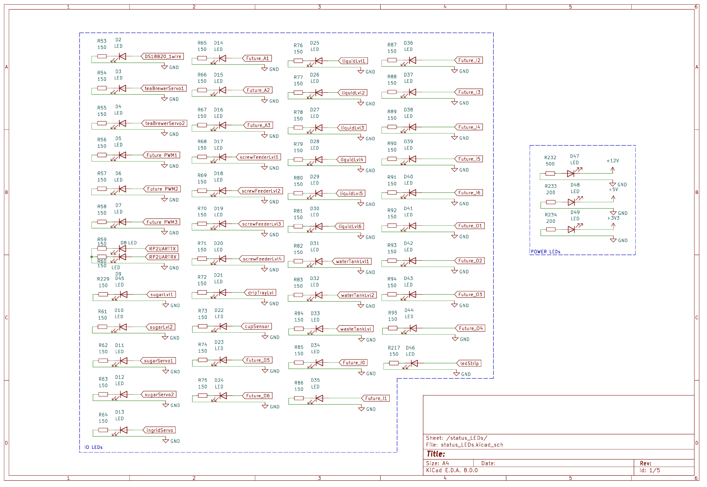
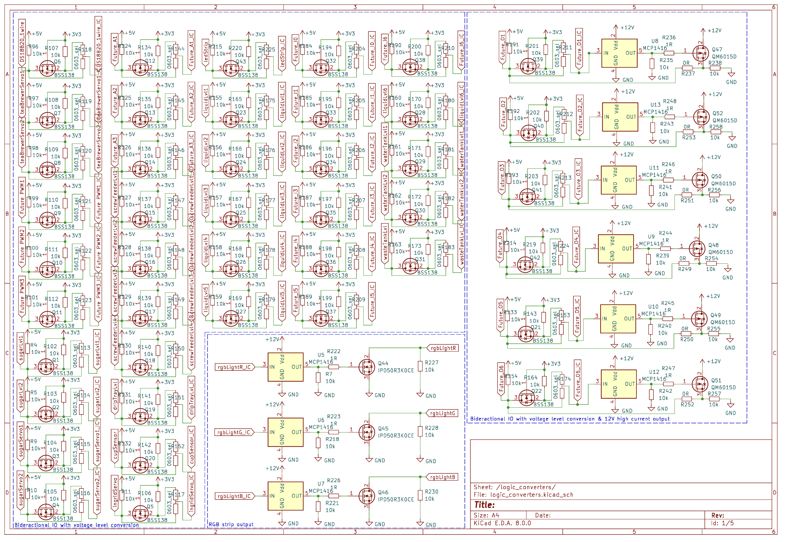
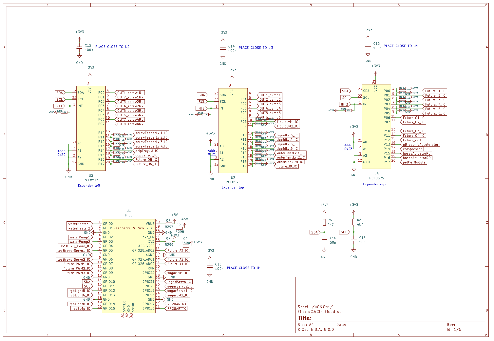
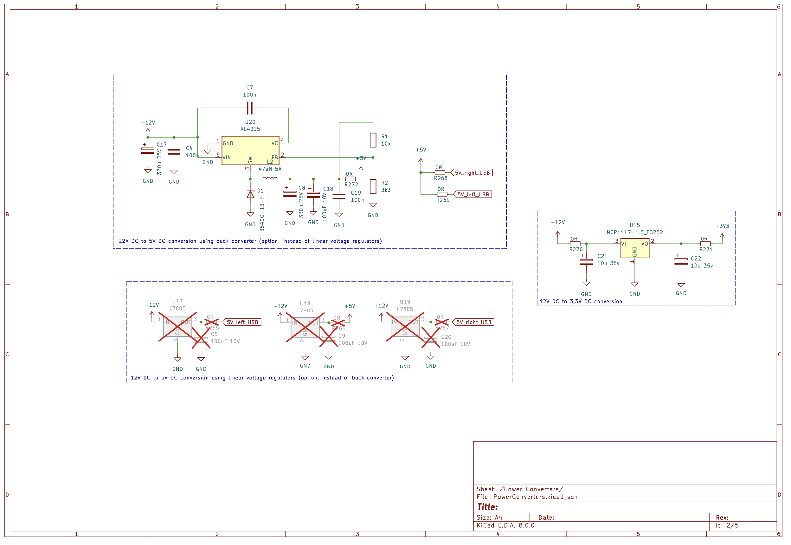
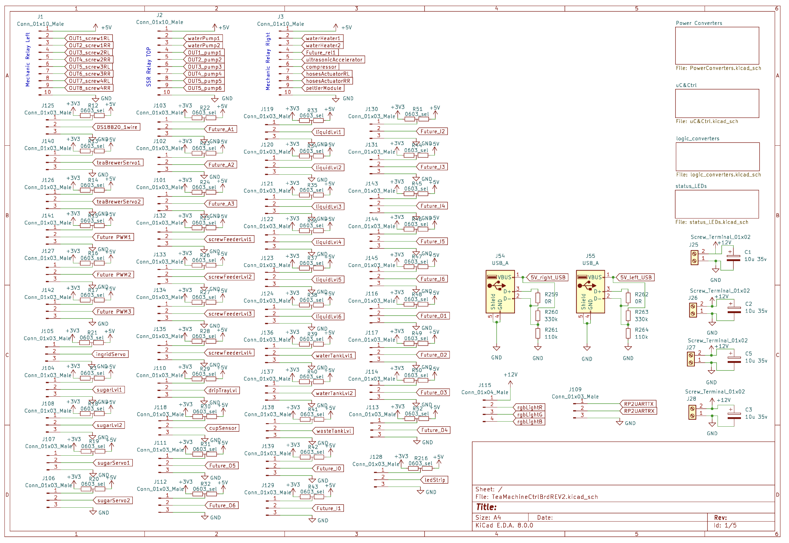
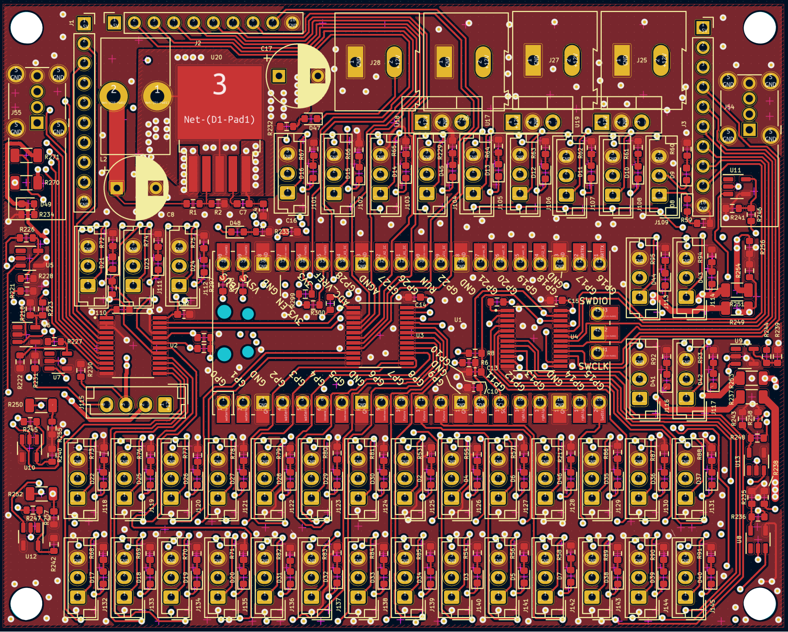
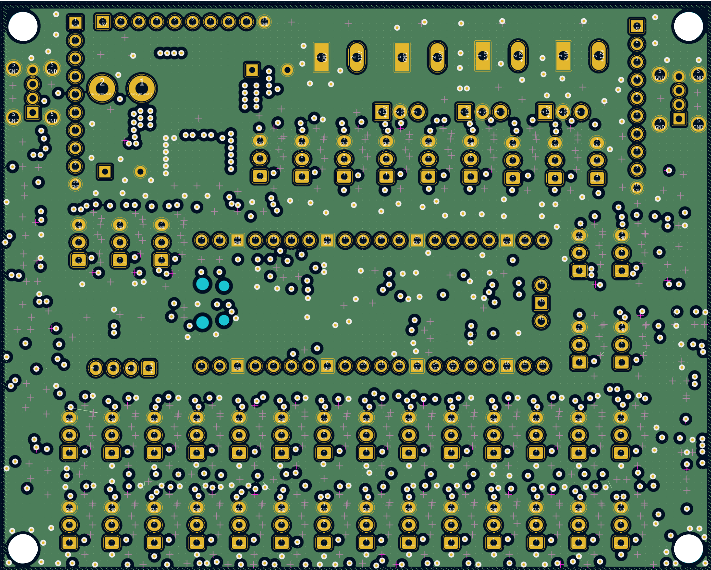
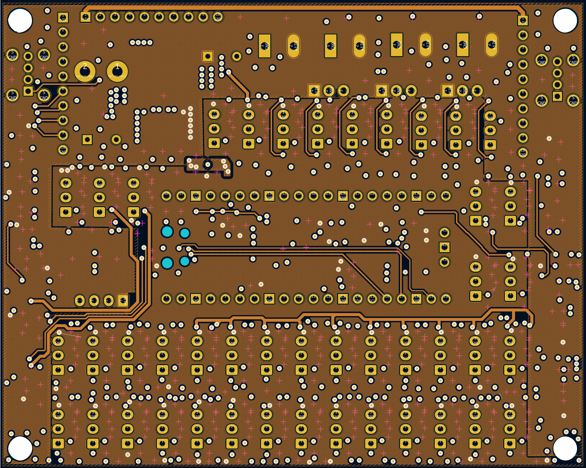
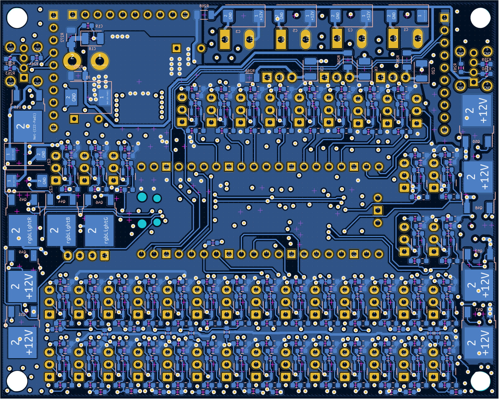

# TeaMachineControlBoard

This project was developed as part of my bachelor's thesis.  The main goal of the whole project was to design a working control board for a
tea express, implement and test the system. The Kicad program was used to design it.
The PCB board is four-layered, made of FR-4 laminate. It contains components
made in both surface mount technology (SMT) and through-hole technology (THT).
After completing the design and assembling the production documentation, an order for
the board was made from the company JLCPCB. The components were assembled
using a pick and place (PnP) machine and by hand. Individual parts of the system were
started one by one until the complete device was fully operational. To this end, a piece
of software was written to sequentially control individual outputs. Electrical and
thermal tests were conducted using a thermal imaging camera.

## Schematics

The design incorporates an RP Pico in a devkit form, three I2C PCF8575 expanders, and a step-down converter from 12V to 5V based on the XL4015. An alternative solution for potential issues is the LM7805, designated as 'do not populate'. The conversion from 12V to 3.3V is achieved using an NCP1117. The project features universal input-output blocks with adjustable logic voltage, RGB strip control, and six 12V switching outputs.

## PCB Details

The PCB is a four-layer board that has been ordered and manufactured through JLCPCB.

## Assembly

SMD components were positioned using a pick & place machine and subsequently soldered in a reflow oven.

## Troubleshooting During System Startup

#### Initial Visual Inspection and Microscopic Examination

The process of bringing the PCB to life began with a thorough visual inspection, utilizing a microscope to check all components for possible imperfections. Identified issues included shorts between IC pins, unsoldered points, misplaced elements, and improperly seated or oriented components. These were rectified using a traditional soldering iron and a hot air rework station.

#### Electrical and Continuity Checks

Further checks were made for shorts between power signals and for the continuity of other critical signals. Intentionally, voltage converter connecting resistors were not installed initially to verify idle state voltages provided by the converters. Upon applying 12V from a lab power supply with a current limit set to 100mA, both the XL4015 converter and the NCP1117 voltage regulator were tested for their output voltages.

#### Soldering Connecting Resistors

After these initial tests, connecting resistors R272, R268, R269, and R271 were soldered to link the converter to the power lines. The power supply was re-engaged to ensure no components caused shorts or drew excessive current. No shorts were observed, but unlit LEDs indicated issues with specific output channels, attributed to improper solder joints and subsequently corrected.

#### Introduction of the Microcontroller

The lab power supply was disconnected and a pin header was soldered to mount the RPI Pico module. A temporary connection from the module's 3V3 signal to the PCB's 3.3V power supply was established via a jumper resistor (R299). The system was then connected to a computer, and test software was uploaded to configure all RPI Pico pins and outputs, sequentially illuminating LEDs to indicate functionality. I2C expanders PCF8575 were also configured as outputs, periodically set to a low state, to observe system behavior post-microcontroller installation.

#### Encountering and Addressing Complex Issues

Despite these steps, the system did not perform as expected, with some LEDs not lighting up at all or flashing out of sequence. The troubleshooting process was time-consuming and complex, involving issues partly due to design and partly external factors. One identified problem was a solder bridge between SDA and SCL pins on an expander, only visible under a microscope at a steep angle, which impeded I2C communication.

#### Investigating Internal Short Circuits

Upon a more detailed inspection, no shorts were found on the I2C bus components. Signal routing on the PCB was verified to be correct. After desoldering all ICs and connected components, SDA and SCL lines were still found to be shorted. A thorough microscopic inspection of both signal layers did not reveal any anomalies, suggesting a potential internal PCB layer short. A radical approach using a constant current supply and thermal imaging to locate the short was undertaken. The application of approximately 2V caused a current flow of 3A, which unexpectedly ceased, indicating the short was cleared by burning through the bridging element, though its exact location remained undetermined.

#### I2C Communication Challenges

Attempts to re-establish I2C communication were made using Adafruit's I2C detect software, which indicated a lack of response from devices at certain addresses. Voltage checks on SDA and SCL lines were correct, and signal analysis confirmed correct transmission of SETUP messages without acknowledgment from the addressed device. This led to the discovery of counterfeit PCF8575 chips, differentiated by their markings and the absence of Philips branding, which ceased semiconductor production in 2006.

#### Software Bugs and GPIO Misconfigurations

Software errors, including inappropriate configuration of GPIO ports for I2C communication, resulted in internal shorts and reset loops. These were traced back to both the test program and the Arduino IDE library for the RPI Pico, with unresolved issues related to GPIO pin configuration potentially causing conflicts within the I2C block.

## Tests Summary

#### Long-Term Operation and Thermal Analysis

The tests were designed to observe the board's performance over extended periods and analyze the thermal behavior of individual components and the entire system. After resolving software-related stability issues, the board was left to operate idly for more than 24 hours, during which it continued to function without any peripheral devices connected. Power cycling tests showed consistent and reliable startup.

#### Voltage Converter and Linear Regulator Tests

Initial voltage accuracy was confirmed using a multimeter and oscilloscope. Load tests were conducted using an active load and thermal imaging to examine two main components: the 12V to 5V converter and the 12V to 3.3V linear regulator.

For the XL4015 converter, a 15W load was applied. The thermal image captured showed that all components, including the coil, remained within safe operational temperatures, although the coil's temperature was unexpectedly high. It was suggested that future designs might consider an SMD-mounted coil to dissipate heat more efficiently or a coil with lower resistance. However, component modification was deemed unnecessary as the operational parameters were within acceptable limits.

The linear regulator test subjected the NCP1117 to a significant load, resulting in notable heating, typical of linear regulators due to the substantial voltage difference between input and output. It was noted that the tested load was much higher than what the device would experience during normal operation, with the RPI Pico's internal 5V to 3.3V regulator handling most power requirements, leaving the NCP1117 to power low-current sensors.

#### Final Application Testing

After SMT and THT assembly and initial board startup, the board was tested in its intended application within a tea brewing machine. This involved connecting an LED strip and all relay modules and running test software to verify correct operation, including alternating relay activation, which functioned as expected. Thermal imaging of the board in operation highlighted the main heat sources, including voltage converters, the RP2040 chip, and expanders, without detecting dangerously high temperatures that could compromise the system's safety.

#### Firmware for Testing

A test program was developed to configure all RPI Pico pins (excluding I2C communication pins) as outputs, executing various output sequences. This setup, combined with installed LEDs, allowed for verifying the operation of each output. Similarly, all signals on the PCF8575 expanders were set as outputs and temporarily pulled to ground level. The program, written in the Arduino IDE, successfully demonstrated the board's functionality through sequential activation and deactivation of outputs and LEDs, confirming the successful operation and stability of the system under test conditions.

